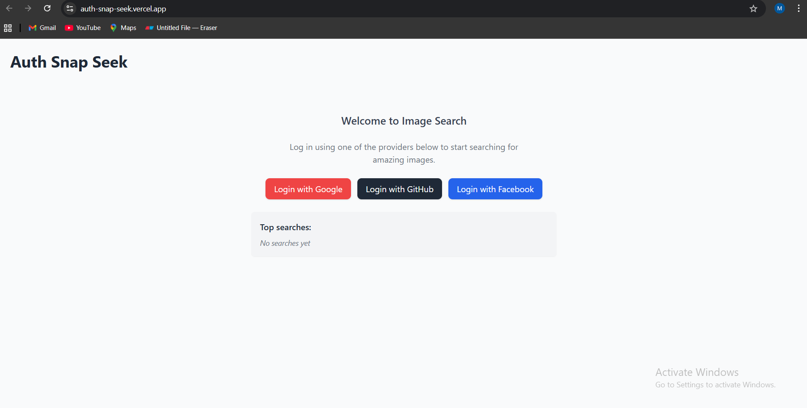
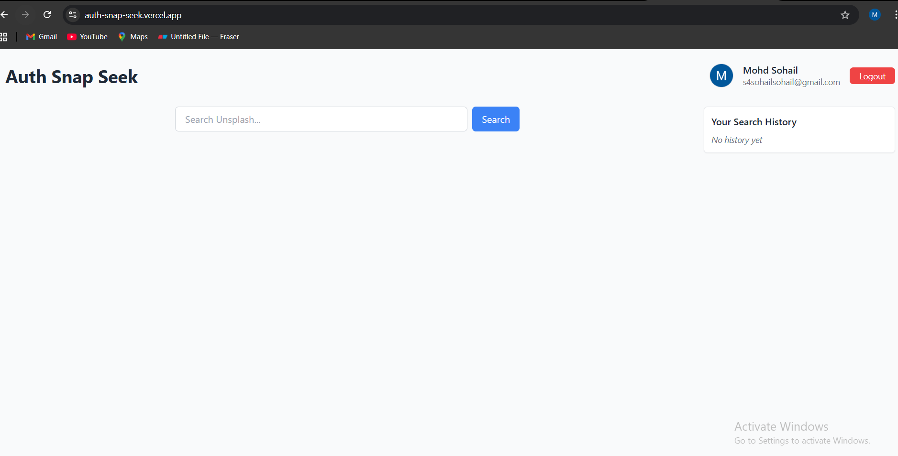
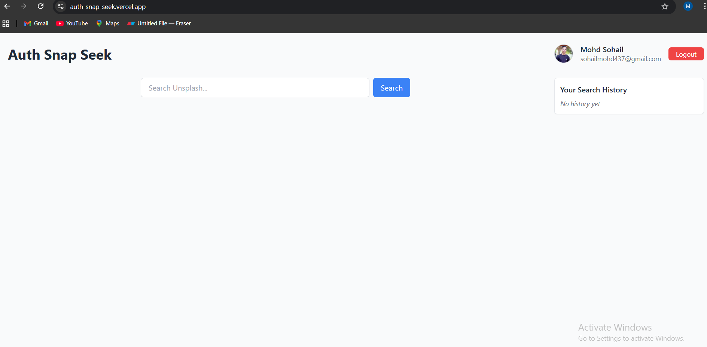
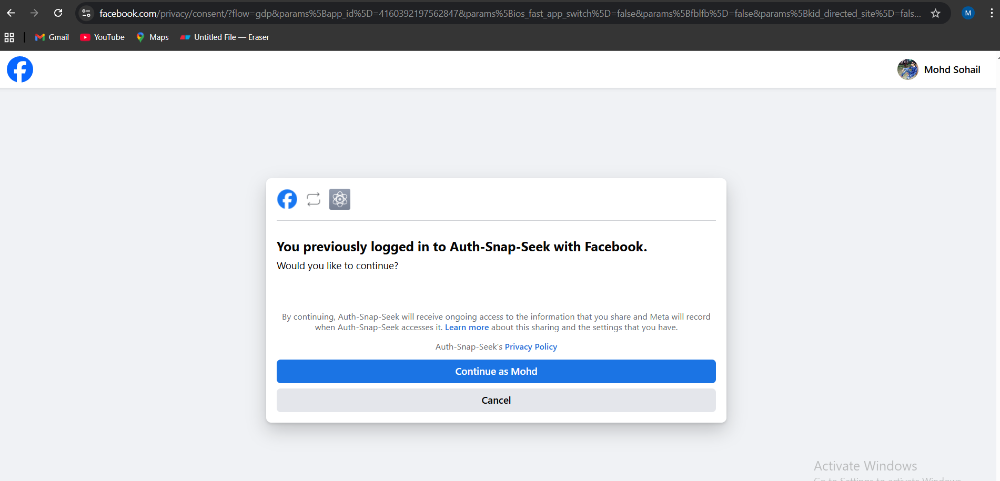
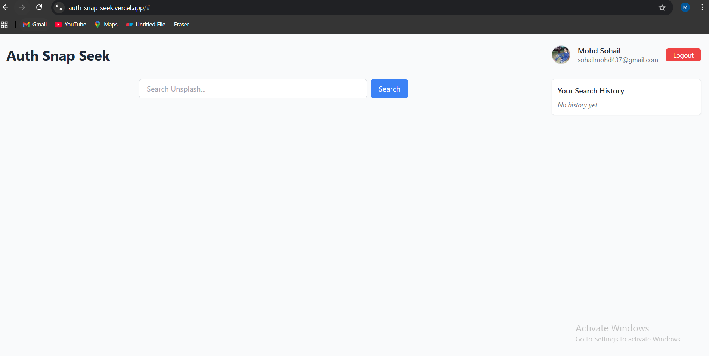
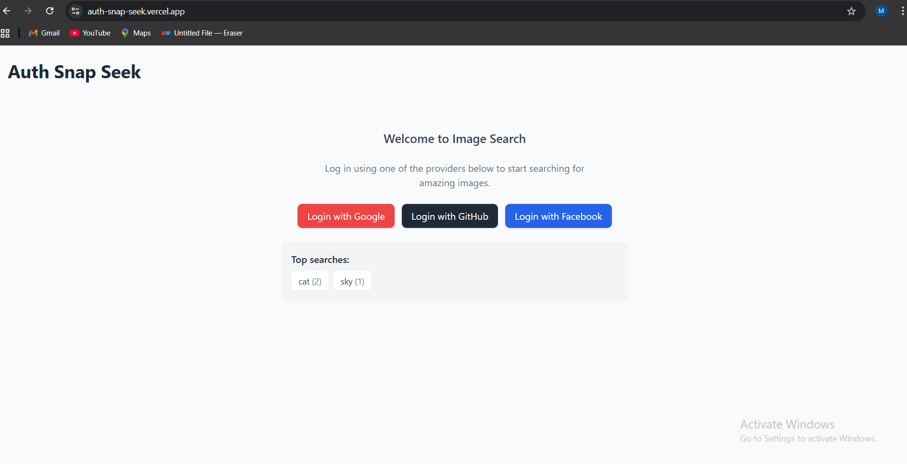
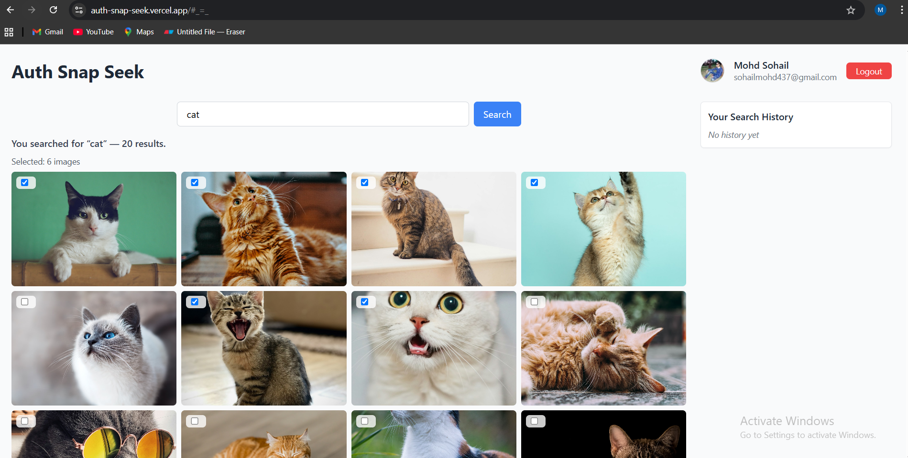
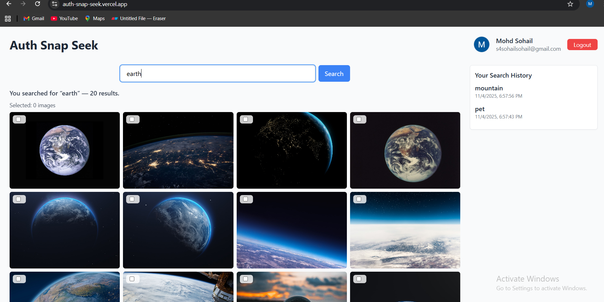
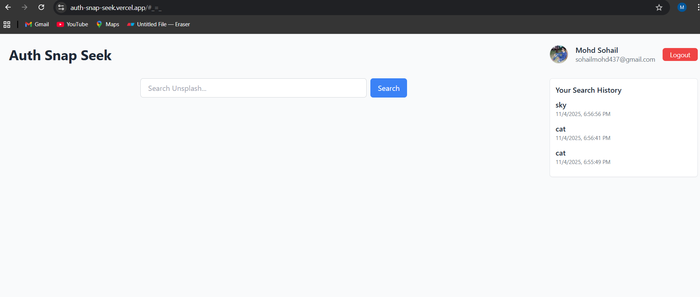

# AuthSnapSeek 🖼️  
A MERN + OAuth powered image search app with Unsplash integration, search history tracking, and global top searches.

## Project Overview
AuthSnapSeek is a full-stack application built using the **MERN stack (MongoDB, Express.js, React.js, Node.js)** with **OAuth authentication** (Google, GitHub, Facebook).  
Only authenticated users can search for images via the **Unsplash API**, view their personal search history, and see the globally most searched terms.

---

##  Core Features
 OAuth Login (Google, GitHub, Facebook) using Passport.js  
 Search images from Unsplash API (only after login)  
 Multi-select grid with live counter  
 User-specific search history saved in MongoDB  
 Global Top Searches banner (aggregated across all users)  
 Session persists after refresh  
 Protected routes for authenticated users only  

---

## 📂 Folder Structure
```bash
authsnapseek/
│
├── screenshots/              
│
├── client/                     # React Frontend
│ ├── src/
│ │ ├── components/
│ │ ├── pages/
│ │ ├── api/
│ │ ├── context/              
│ │ └── App.jsx
│ ├── public/
│ └── package.json
│
├── server/                     # Express Backend
│ ├── config/                   # Passport + OAuth config
│ ├── controllers/
│ ├── models/                   # MongoDB Models: User, SearchEntry
│ ├── routes/                   # /auth, /api/search, /api/history, /api/top-searches
│ ├── utils/
│ ├── server.js
│ └── package.json
│
└── README.md
```


---

## Environment Variables (.env)

### Backend (`/server/.env`)
```bash
PORT=4000
MONGO_URI=your_mongodb_connection_string

SESSION_SECRET=your_session_secret

GOOGLE_CLIENT_ID=xxxxx
GOOGLE_CLIENT_SECRET=xxxxx

GITHUB_CLIENT_ID=xxxxx
GITHUB_CLIENT_SECRET=xxxxx

FACEBOOK_CLIENT_ID=xxxxx
FACEBOOK_CLIENT_SECRET=xxxxx

UNSPLASH_ACCESS_KEY=your_unsplash_api_key
CLIENT_URL=http://localhost:3000
```

### Frontend (`/client/.env`)
```bash
REACT_APP_BACKEND_URL=http://localhost:4000
```

---

##  Installation & Setup

### 1️⃣ Clone Repo
```bash
git clone https://github.com/Mohdsohail7/Auth-Snap-Seek.git
```
cd Auth-Snap-Seek

### 2️⃣ Install Dependencies
```bash
cd server && npm install
```
```bash
cd ../client && npm install
```
### 3️⃣ Add .env files in client/ and server/

### 4️⃣ Start Backend
```bash
cd server
npm start
```
### 5️⃣ Start Frontend
```bash
cd client
npm start
```
or 
### Run both together 
```bash 
cd auth-snap-seek
npm start
```
App will run at:
➡️ Frontend: http://localhost:3000
➡️ Backend: http://localhost:4000

## API Endpoints
| Method | Endpoint            | Description                              |
| ------ | ------------------- | ---------------------------------------- |
| POST   | `/api/search`       | Search images. Body: `{ "term": "dog" }` |
| GET    | `/api/history`      | Fetch current user's search history      |
| GET    | `/api/top-searches` | Get global top 5 searched terms          |

## cURL Examples
### Search Images
```bash
curl -X POST http://localhost:4000/api/search \
  -H "Content-Type: application/json" \
  --cookie "connect.sid=YOUR_SESSION_COOKIE" \
  -d '{"term": "mountain"}'
```
### User History
```bash
curl http://localhost:4000/api/history \
  --cookie "connect.sid=YOUR_SESSION_COOKIE"
```
### Top Searches
```bash
curl http://localhost:4000/api/top-searches \
  --cookie "connect.sid=YOUR_SESSION_COOKIE"
```

## Visual Proof (Screenshots / GIFs)
home page

# OAuth Login
### google login


### github login


### facebook login


### facebook login


### Top Searches Banner


### Search + Multi-select


### Search History



## Tech Stack

| Layer           | Technology                         |
| --------------- | ---------------------------------- |
| Frontend        | React + Axios + Context API        |
| Backend         | Node.js + Express.js + Passport.js |
| Database        | MongoDB + Mongoose                 |
| Auth            | Google, GitHub, Facebook OAuth     |
| API             | Unsplash Search API                |
| Session Storage | MongoDB via `connect-mongo`        |

## project live link
https://auth-snap-seek.vercel.app


# 👨‍💻 Author

Mohd Sohail
🔗 [GitHub Profile](https://github.com/Mohdsohail7)

📧 [s4sohailsohail@gmail.com](mailto:s4sohailsohail@gmail.com)

## 🪪 License
This project is licensed under the ISC License — feel free to use or modify for learning/demo purposes.

